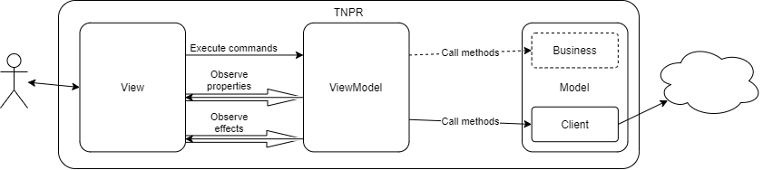
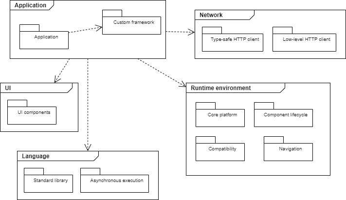
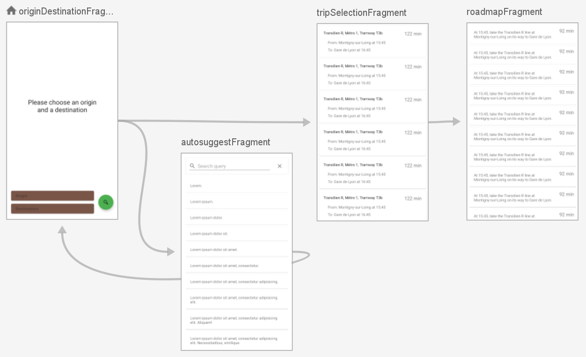

## Architecture

### System

Here is a view of the interactions between the TNPR application and external components (web services, SDKs...):


For now, TNPR only uses one external component which is the Navitia web service.

Navitia provides two routes that TNPR uses:
1. Find places (`/places`). It is used by the [place suggestion feature](README.md#place-suggestion-feature).
2. Find journeys (`/journeys`). It is used by the [journey search feature](README.md#journey-search-feature).

### Layers

TODO



### Dependencies

TODO: remove "abstract" diagram

The dependencies of TNPR can be represented in two ways: 
- Abstract, where each dependency is labeled in a generic way, independant of the framework: "standard library", "type-safe HTTP client"... 
    This exact representation of the dependencies could apply to the same application not targeting Android, but instead a web browser or a desktop OS.
- Concrete, where each dependency is labeled specifically as the implementation that is used in TNPR: "standard libary" → `kotlin.stdlib`, "type-safe HTTP client" → `com.squareup.retrofit2`. 

| Concrete                                 | Abstract                                 |
|------------------------------------------|------------------------------------------|
|  |  |

Each diagram is split into high-level packages: Application, Network, UI, Runtime environment and Language.

Read on to learn about these packages.

#### Application (`me.cpele`)

This package contains TNPR's source code (`tnpr` subpackage) and a custom framework (`afk` subpackage).

`afk` is a lightweight framework on which Android apps can be based. It also contains reusable classes and functions.

Why extract these classes as a custom framework? Everytime I create a new Android app, I create or copy/paste these classes. So I thought it would be appropriate to code them once and reuse them later. NB: for now `me.cpele.afk` is part of TNPR, but in the future it will be distributed separately.

It contains:

- `Component`: this is an interface that can be implemented by the app's `ViewModel`s: 
  - It has a `dispatch(Action)` method which executes an `Action`. An `Action` could be e.g. `LoadData(id: Int)` to trigger a request to a web service and load data, or `SearchJourneys(origin: Place, destiation: Place)` to find a journey from a point A to a point B.
  - It has a `stateLive` property representing the "state" or "model" of a view, expressed in a way that should be independent of the UI framework.
  - It has an `eventLive` property that allows "events" or "effects" to come back to the UI without forcing the `Component` to retain a reference to the view. 

- Some utility classes or functions:
  - `ViewModelFactory`: a generic `ViewModelProvider.Factory` that is used to instantiate a `ViewModel` from an `Activity` or a `Fragment` like this:
    ```kotlin
    private val viewModel: AutosuggestViewModel by viewModels {
        ViewModelFactory {
            AutosuggestViewModel(
                CustomApp.instance.navitiaService
            )
        }
    }
    ```
  - `Event`: a data holder that can be "consumed". It is used by the `Component.eventLive` property to represent one-shot events that "bubble up" to the UI. One use case of this class is display a message only once using `Toast`.
  - `Outcome`: like a `kotlin.Result`, it represents an outcome that can be successful (`Outcome.success(obj)`) or a failure (`Outcome.failure(throwable)`). But unlike `Result`, `Outcome` can be returned by functions. It is used mainly to call web services.
  - `Dates.kt`: date parsing

#### Network

The network package is `com.squareup`, it contains the libraries provided by Square to manage HTTP connections: `retrofit2` and `okhttp3`.

These libraries have been chosen because they are well established and widely known.

#### UI

Some UI components come from [Material Components](https://material.io/components?platform=android).

Why? Material components are cross-platform, abundantly documented and commonly used.

## Language: `org.jetbrains`

The app depends on this package that provides the Kotlin standard library (`kotlin.stdlib`) and the Coroutines library (`kotlinx.coroutines`).

Coroutines are used to implement asynchronous operations like calls to web services.

Flows are used to implement asynchronous operations reperesented as streams, for example it allows to handle the user input in the Autosuggest screen.

## Runtime environment: `androidx`

Some AndroidX libraries bring Android related facilities (Jetpack), utilities that are provided as libraries.

The `core` subpackage is for extensions of the Android SDK, it brings e.g. `View.children` or `Context.getSystemService`.

`lifecycle` brings facilities to manage Android components that have a lifecycle like Activities or Fragments. This is the home of the `ViewModel` and `LiveData` classes. `LiveData` could be replaced by `Flow` but `LiveData` is still widely used and better suited to Android.

`appcompat` implements components that supersed those that come with the Android SDK, it has better backward and forward compatibiliy e.g. `ActivityCompat`.

`navigation` is the Jetpack component to implement navigation. It has drawbacks, mostly in the dependency relations it requires, but it was a simple way to design the app's navigation efficiently. It also provides editing tools that offer a global view of the app's UI, as you'll see [in the Features section](#features-diagram).

### Features

Thanks to Jetpack Navigation, here is a diagram showing all of the app's screens.



### Experiments

This app was a way for me to try a few things I could not try on my day job as and Android developer. In this section you'll find some of the experiments I tried.

#### Transmodel

Transmodel is the name of a reference data model to represent public transport data. I tried to use it as the internal data model of the application, but decided not to use it.

Transmodel is a complex model, its complexity comes from features which were not useful for the purpose of TNPR, notably:

- Separate concepts for the spatial and temporal aspects of transport data
- A representation for passengers, drivers and other types of "users" of public tranport modes

I choosed to stay with a projection of the Navitia data model. By "projection" I mean that I took the model as is, only keeping the resources and attributes I wanted TNPR to manage. Navitia's model is simpler and better suited for an application that is only targeted at passengers.

#### Flow

TODO?

#### Cycle.js

TODO