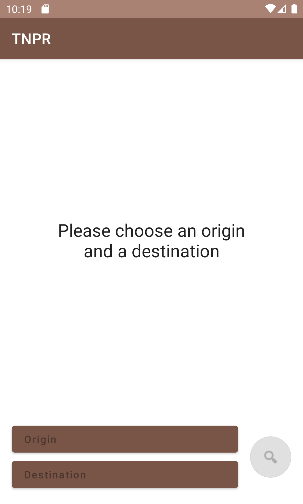
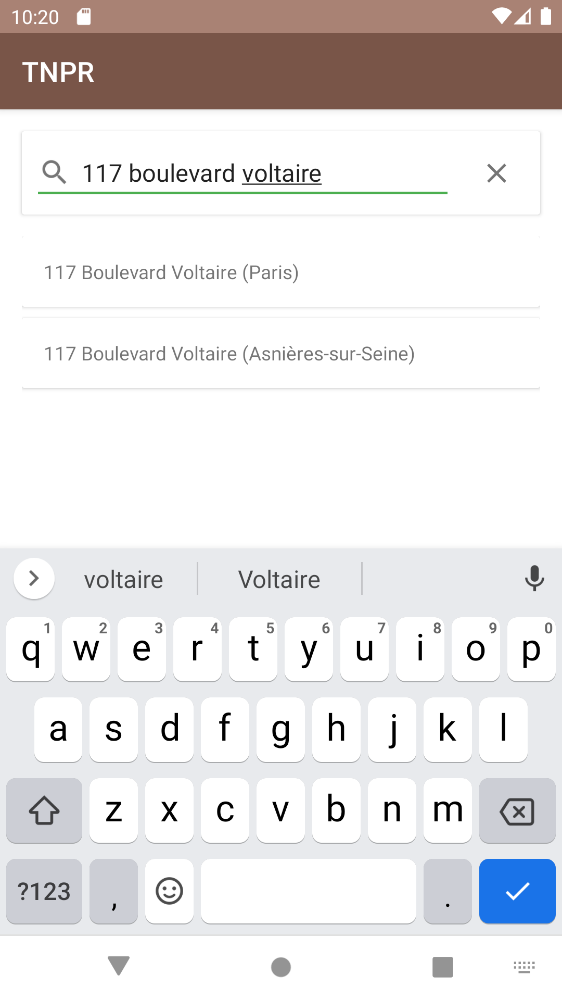
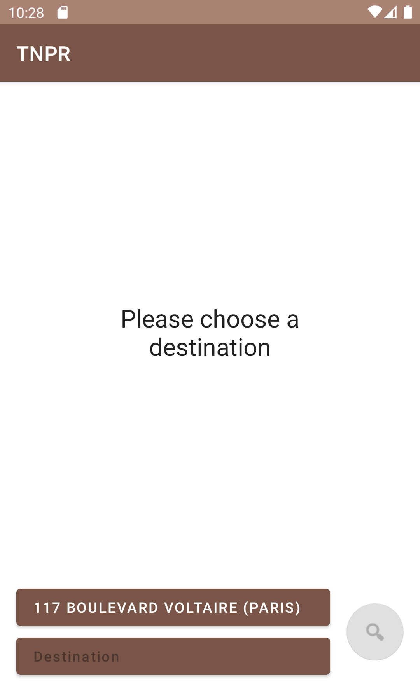
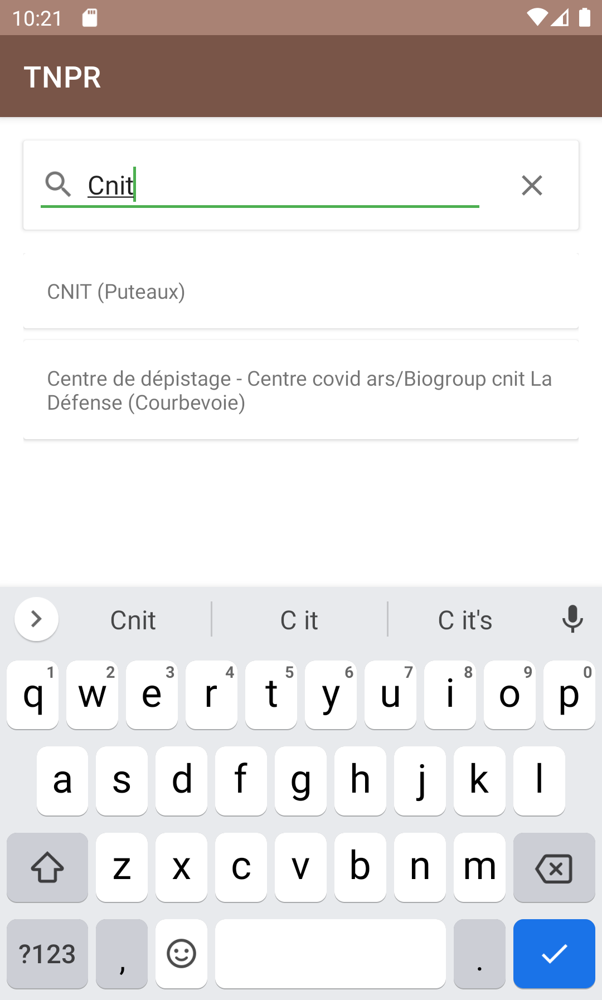
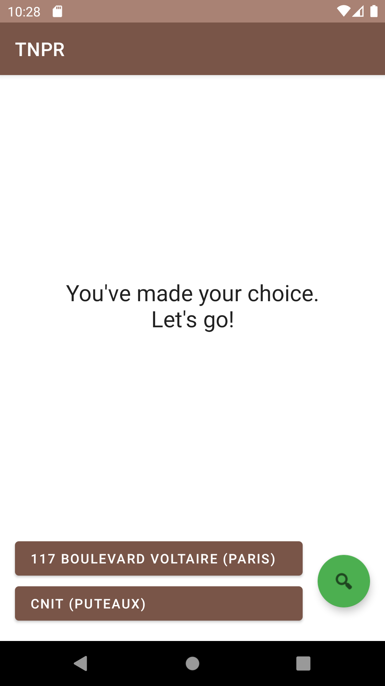
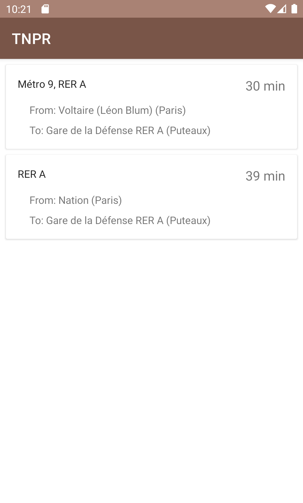
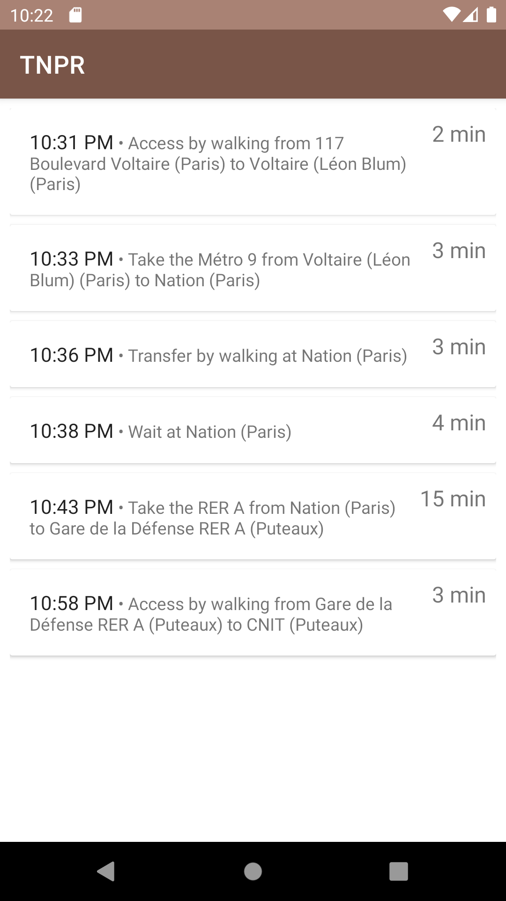

# TNPR

TNPR is an public transport Android application. It allows to plan a journey in France near Paris, from a point A to a point B.

It uses [Navitia](https://navitia.io), which is "the open API for building cool stuff with transport data".

## Installation

- Open [github.com/geekarist/tnpr/releases](https://github.com/geekarist/tnpr/releases) _on your Android device_
- Look at the "Assets" of the latest release
- Download the `.apk` file
- Open the downloaded file
- Confirm the installation

## Usage

When you open the application, the initial screen lets you choose an origin and a destination for your journey. 

Press the "Origin" button to choose an origin.

The next screen will suggest you a place based on any text you type: an address, a point of interest, etc. Start typing an address, e.g. "117 boulevard voltaire".

Choose the first suggestion, which is in Paris, then you're back to the initial screen.

Before searching for journeys, you have to choose a destination so press the "Destination" button.

Type "cnit" in the next screen and press the first suggestion (CNIT is a business center near Paris).

Back again to the initial screen, but now you can press the button with the 🔍 icon to find journeys from your origin to your destination.

Press the 🔍 button.

The next screen shows you the best journeys from your origin to your destination. The first item is the most "interesting" one because it has transfers. 

Press the first item.

The last screen displays your journey in detail. You see each section of it, including when you have to wait or transfer from a transport mode to another. 

## Architecture

### System

TODO

### Dependencies

| Concrete                                 | Abstract                                 |
|------------------------------------------|------------------------------------------|
|  |  |

TODO

### Features

TODO

### Layers

## Contributing

Unfortunately, I won't have time to maintain this repository, develop new features nor fix issues. 

I won't take any pull request.

But the repository can be forked and the [Discussion](discussions) feature is enabled.

## LICENSE

See [COPYING](COPYING).
